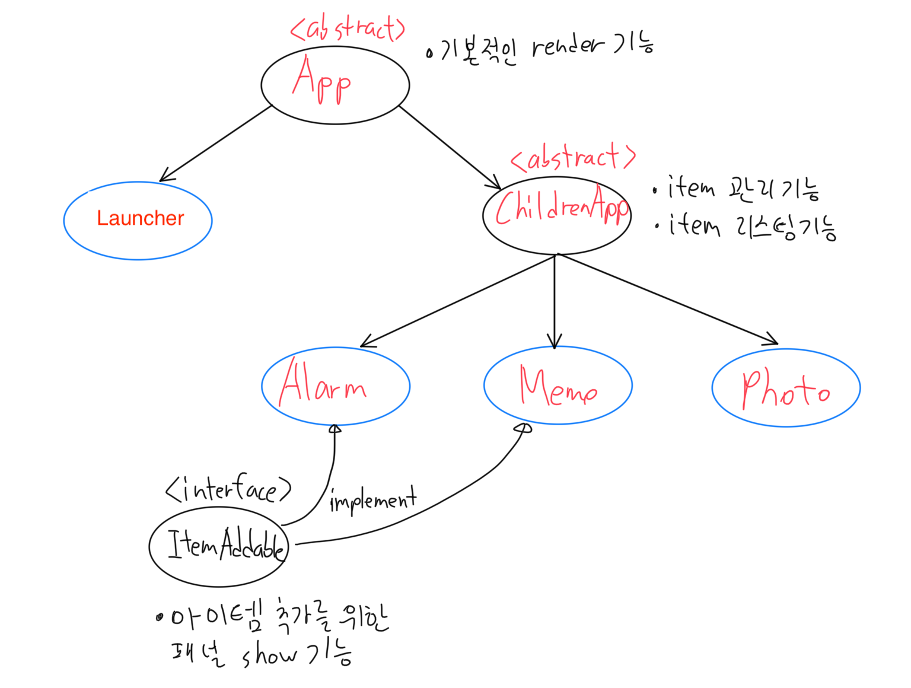

# VanilaJS 로 작성한 APP

홈 화면에서 메모, 알림, 사진 앱을 간단히 실행시키는 기본적인 SPA APP 입니다.

- 수행기간: 2020.12 3일
- HTML, CSS, Javascript 만을 이용하여 테스트코드까지 심혈을 기울여 만든 프로그램입니다.
- 구조적으로 개발하기 위해 많은 노력을 기울였습니다. 무엇하나 대충짜지 않고 웹 표준, 접근성, 구조적인 CSS, 클래스 상속관계 전부다 녹였습니다.
- 사용기술: ES6+ TypeScript HTML CSS Jest


## 목차

- [실행 방법](#실행-방법)
  - [로컬서버실행](#로컬서버실행)
  - [테스트](#테스트)
  - [빌드](#빌드)
- [모듈(파일 구조)](#모듈파일-구조)
- [참고사항](#참고사항)
  - [프로그램 동작 방식](#프로그램-동작-방식)
  - [클래스 상속관계](#클래스-상속관계)
  - [Element 생성](#element-생성)
  - [태그 구조 & 접근성 개선](#태그-구조--접근성-개선)
  - [CSS 스타일링](#css-스타일링)
  - [테스트](#테스트-1)

## 실행 방법

dist 폴더에 `index.html`, `style.css`, `images` 가 준비되어 있고 index.html 에서 번들링된 js 파일을 실행시키는 구조이며, 아래의 명령어를 실행하시면 됩니다.

### 로컬서버실행

```
npm start
```

[http://localhost:9000](http://localhost:9000) 에서 실행됩니다.

### 테스트

```
npm test
```

jest --watch 가 실행됩니다.

### 빌드

```
npm build
```

dist 폴더에 bundle.js 가 생성되어, dist 를 웹서버에 배포하기위한 준비가 완료됩니다.

## 모듈(파일 구조)

Launcher(RootApp, 런쳐)앱에서 하위 앱(ChildrenApp) 을 담아 실행하는 구조입니다.

```
├── dist
├── src
│   ├── components
│   │   ├── ChildrenApp
│   │   │   ├── Alarm.ts
│   │   │   ├── Memo.ts
│   │   │   └── Photo.ts
│   │   └── RootApp
│   │       └── Launcher.ts
│   ├── types
│   │   └── CoreTypes.ts
│   ├── utils
│   │   └── time.ts
│   └── index.ts
├── package.json
├── tsconfig.json
└── webpack.config.js
```

- **dist** : 웹서버가 실행되는 위치, 빌드시에는 배포할 파일의 묶음이 되는 곳입니다. 원활한 실행을 위하여 내용물은 지우지 않습니다.
- **src** : 번들링, 테스팅 될 typescript 파일이 모여있는 곳입니다.
- **components** : 앱단위 컴포넌트 모음입니다.
- **ChildrenApp** : 런쳐 앱에 들어갈 앱들 입니다.
- **RootApp** : 런쳐 역할을 할 앱입니다.
- **types** : 공통적으로 쓰이는 타입들을 모았습니다. 코어 역할을 하는 클래스들을 담았습니다.
- **utils** : 유틸리티 함수를 넣는 곳입니다.

## 참고사항

### 프로그램 동작 방식

- 프로그램은 Launcher, Alarm, Memo, Photo 총 4개가 있으며, Launcher 를 RootApp, 나머지를 ChildrenApp 이라고 정했습니다.
- Launcher 가 먼저 실행되고 Launcher 안에서 Alarm, Memo, Photo 가 실행되는 구조입니다.
- Launcher 는 body 내의 `div#root` 에 부착되고, Launcher 의 생성자에서 ChildrenApp 이 들어갈 DOM Container Element 가 생성되고, 그 Element에 ChildrenApp이 부착됩니다. (생성자에, 부착될 Container 가 전달됩니다.)
- 각 앱은 render() 메소드를 가지어, 사용자 인터렉션 및 상태변화(item 변화)에 따라 재호출이 되어 어느정도의 선언형 프로그래밍의 구색을 갖추고 있습니다. 그러나 무분별하게 전체 리프레쉬되어(특히 사진앱) 사용자경험이 나빠질 것을 염려하여 일부 앱에서는 render 메서드 위에 `render~~~` 라는 부분화면 렌더 메서드를 따로 구현 했습니다.

### 클래스 상속관계

`src/types/CoreTypes.ts` 에 공통적으로 사용되는 클래스를 정의해두었습니다.

`CoreTypes.ts`에 정의된 타입은 App, ChildrenApp, ItemAddable 총 3가지가 있습니다. App 추상클래스는 render 기능의 구현을 강제하기 위하여 render 메서드를 abstract 로 설정하였습니다.

Launcher 클래스는 App 이기도 하고 Children 앱이라는 아이템을 관리하기도 하지만 좀 구현이 다르고 특수한 앱이라 App 을 바로 상속받아 코드를 작성해 나갔습니다.

그 외의 Alarm, Memo, Photo 클래스는 아이템을 정해진 포맷으로 관리하고 리스팅 하므로 ChildrenApp 이라는 공통된 추상클래스 부모를 만들어 상속받도록 했습니다. 아이템 관리하는 메서드(loadItems, addItem, removeItem, item getter 및 setter) 내부에 localStorage 와 동기화 하는 기능을 전부 심어 놓았기 때문에 아이템 관리하는 것에대한 유지보수가 매우 좋았습니다.

이 셋 앱중 Alarm, Memo 는 아이템 추가기능을 가지고 있으나, Photo 는 오직 아이템 Display 기능만 하므로 아이템 추가기능은 공통속성으로 두진 않았습니다. 아이템 추가기능을 담당하는 ItemAddable 이라는 인터페이스를 따로 만들어 Alarm, Memo 앱에서만 따로 Implements 할수 있도록 했습니다.

### Element 생성

HTML 텍스트로 생성하지 않고, `createElement` DOM API로 생성하였습니다. 이에 따라 코드가 방대해 지는것을 방지하기 위해 꼭 필요한 Element 만 생성하도록 하였습니다. 컴포넌트 생성 메서드 위의 주석에 적어놓은 **emmet** 방식의 구조를 보시면 약간이라도 코드 읽으시는데 도움될것 같습니다.

### 태그 구조 & 접근성 개선

화면 요소의 역할에 맞는 태그를 사용하려 노력했습니다. 특히 앱 아이콘, BACK NEW 버튼, input 요소, 사진 등은 모두 스크린 리더로부터 '누를수 있다'는 항목으로 읽혀지기 위하여, 그리고 손이 불편한 사람을 위하여 키보드로 포커싱하고 엔터로 클릭효과가 가능하도록 모두 버튼으로 구성했습니다. 메모 목록 또한 그것이 가능하도록 메모내용을 버튼으로 감쌌습니다.

또한 NEW 버튼을 눌러 나오는 폼은 전부 GET,POST 액션을 취하지 않더라도 form 태그로 구성하였습니다. 그 이유는 form 태그여야만이 ENTER 를 눌렀을 시 submit 이벤트가 기본적으로 발생하고 event.target 객체에서 name 에 따른 value 를 수월하게 뽑아낼 수 있기 때문입니다.

그리고 사진앱에서 사진이 정가운데 Contain 상태로 와야한다는 조건을 충족하기 위해 Background 테크닉을 사용하였습니다. 하지만 이렇게만 하면 스크린리더에서 읽지 못하여 전맹시각장애인이 사진을 인지하지 못하므로, img 태그를 같이 배치 하였습니다. 단, img 태그는 화면에 안 보이고 스크린리더에만 읽히도록 특별한 히든처리를 하였습니다.

### CSS 스타일링

CSS 스타일링을 위해 id 는 각 앱별로 2개(alarm-list, alarm-form, memo-list, memo-form, photo-list, photo-view) 총 6개를 부여하였고, 최소한의 Selector 로도 스타일링이 가능하도록 노력하였습니다.

### 테스트
아래와 같은 조건을 충족시키는 E2E 테스트케이스를 작성하였습니다.

#### 전체
- 핸드폰 화면과 앱을 에물레이션한 페이지입니다.
- 홈화면과 3개의 앱 알람, 메모, 사진의 총 4개의 화면으로 구성됩니다.
- 앱에서 “BACK” 버튼을 노출하며 클릭시에 홈화면으로 이동합니다.
- SPA로 만들어야 합니다.

#### 홈
1. 상단에 날짜와 시간이 표시되어야 합니다.(모든 화면에서 표시되어야함)
2. 아래 3개의 앱이 표시되어야 합니다.
3. 앱은 Drag & Drop 으로 서로 위치를 이동할 수 있어야 합니다.(핸드폰에서 앱 위치 바꾸는 동작과 같습니다.)
4. 위치는 Local Storage에 저장되어 브라우저 Reload 후에도 바뀐 위치로 나와야 합니다.
5. 각 앱 선택시 해당 앱 화면으로 바뀌어야합니다.
 
#### 알람
1. 우측 상단에 “NEW” 버튼이 있어야 합니다.
2. “NEW” 버튼 클릭시 바로 아래 입력창이 나와야 합니다.
3. 분은 10분 단위로 입력 받습니다.
4. 저장을 클릭하면 아래 리스트에 추가되고 입력창은 사라져야 합니다.
5. 알람 리스트에 “삭제” 클릭시 지워져야 합니다.
6. 알람 시간이 되면 alert 창으로 알람시간을 띄어주고 확인 클릭시 해당 알람은 삭제되어야 합니다.
7. 알람 리스트는 LocalStorage에 저장되며 브라우저 Reload 후에도 모두 그대로 나와야합니다.
 
#### 메모
1. 우측 상단에 “NEW” 버튼이 있어야 합니다.
2. “NEW” 버튼 클릭시 바로 아래 입력창이 나와야 합니다.
3. 메모는 input 태그를 사용하고 엔터키 입력시 저장되며 입력창은 사라져야합니다.
4. 메모 리스트에서는 2줄만 표시되어야 합니다.
5. 해당 메모 클릭시 모든 메모 내용이 나오도록 펼쳐져야 합니다.
6. 한번에 하나의 메모만 펼칠수 있도록 이전에 펼쳐진 메모는 다시 2줄만 표시되도록 합니다.
7. 모든 메모는 LocalStorage에 저장되며 브라우저 Reload 후에도 저장된 메모가 그대로 나와야합니다.
 
#### 사진
1. 사진은 로컬에 사진을 10개 정도 저장한 후 불러오도록 합니다.
2. 상단에 모든 사진 리스트가 나오며 가로 스크롤이 되어야 합니다.
3. 리스트에서 사진을 선택 하면 리스트에 Border등이 생겨 해당 사진이 선택되었다는 표시가 되어야합니다.
4. 선택된 사진은 아래에 표시되어야 하고, 가로 세로 중앙 정렬이며 화면에 딱 맞게 줄어들어야 합니다.
